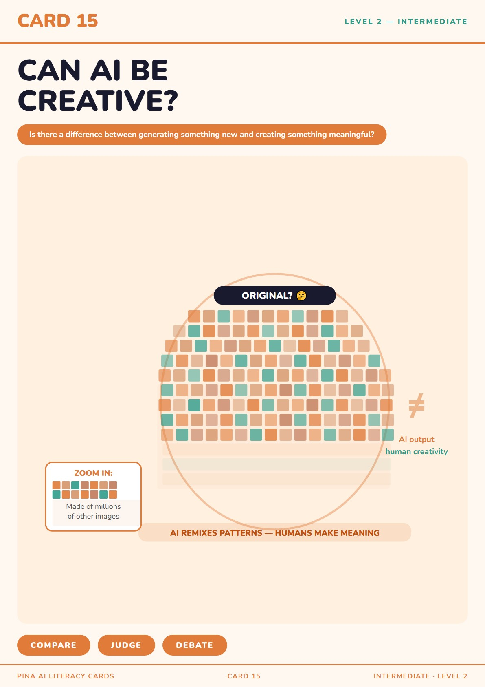

# Pina AI Literacy Cards

Printable AI literacy cards for students ages 9-12, with QR games, no login, and open source classroom materials.

Live site: https://pablosandri05-a11y.github.io/pina-games/

Repository: https://github.com/pablosandri05-a11y/pina-games

## What is inside

Pina includes 23 printable cards divided into three levels:

| Level | Cards | Focus |
|---|---:|---|
| Beginner | 01-10 | First encounters with AI concepts, trust, mistakes, privacy, fairness, and responsibility |
| Intermediate | 11-18 | Prompting, detection, datasets, energy, creativity, data, studying, and jobs |
| Advanced | 19-23 | Ownership, storytelling, manipulation, school policy, and AI governance |

Each card has:

- a printable PDF for classroom use
- an interactive HTML game linked by QR
- a key AI literacy concept
- discussion prompts for teachers and students

## How to use

1. Open the live site and choose a card.
2. Download and print the PDF.
3. Use the printed card to introduce the classroom activity.
4. Students scan the QR code with a phone or tablet.
5. The QR opens a standalone HTML game, with no login or account required.
6. End with the discussion questions on the card.

Most activities are designed for a 45-60 minute classroom session.

## For teachers

- Age range: 9-12 years old
- Duration: 45-60 minutes per card
- Materials: printed card plus a phone or tablet for the QR game
- Setup: no LMS, no install, no student accounts
- Format: printable cards, standalone browser games, and discussion questions
- License: Creative Commons CC BY 4.0

Useful search keywords: AI literacy cards, printable AI education cards, AI activities ages 9-12, no login QR games, open source AI education, primary school AI literacy.

## Card list

| Card | Title | PDF | Game |
|---:|---|---|---|
| 01 | Where Does AI Live? | `card_01_where_ai_lives.pdf` | `game_01_where_ai_lives.html` |
| 02 | What Is AI Good At? | `card_02_what_is_ai_good_at.pdf` | `game_02_what_is_ai_good_at.html` |
| 03 | Does AI Think Like a Human? | `card_03_does_ai_think_like_a_human.pdf` | `game_03_does_ai_think_like_a_human.html` |
| 04 | Can AI Make Mistakes? | `card_04_can_ai_make_mistakes.pdf` | `card4-extension.html` |
| 05 | How Does AI Learn? | `card_05_how_does_ai_learn.pdf` | `card5-extension.html` |
| 06 | Should You Trust AI? | `card_06_should_you_trust_ai.pdf` | `card6-trustmeter.html` |
| 07 | Who Is Responsible? | `card_07_who_is_responsible.pdf` | `card7-responsibility-chain.html` |
| 08 | Can AI Know What Is Fair? | `card_08_can_ai_know_what_is_fair.pdf` | `card8-fairness-chooser.html` |
| 09 | Should AI Choose For You? | `card_09_should_ai_choose_for_you.pdf` | `card9-who-should-decide.html` |
| 10 | Can AI Keep a Secret? | `card_10_can_ai_keep_a_secret.pdf` | `card10-privacy-sorter.html` |
| 11 | How Do You Talk to AI? | `card_11_prompt_trainer.pdf` | `game_11_prompt_trainer.html` |
| 12 | Can You Tell If AI Made It? | `card_12_detection_lab.pdf` | `game_12_detection_lab.html` |
| 13 | Does AI Use Energy? | `card_13_carbon_counter.pdf` | `game_13_carbon_counter.html` |
| 14 | Where Does AI Bias Come From? | `card_14_dataset_builder.pdf` | `game_14_dataset_builder.html` |
| 15 | Can AI Be Creative? | `card_15_creative_turing_test.pdf` | `game_15_creative_turing_test.html` |
| 16 | What Happens to Your Data? | `card_16_data_mapper.pdf` | `game_16_data_mapper.html` |
| 17 | Should AI Help You Study? | `card_17_study_smart.pdf` | `game_17_study_smart.html` |
| 18 | Will AI Change Jobs? | `card_18_job_timeline.pdf` | `game_18_job_timeline.html` |
| 19 | Who Owns AI Art? | `card_19_ownership_simulator.pdf` | `game_19_ownership_simulator.html` |
| 20 | Can AI Tell a Story? | `card_20_theatre_machine.pdf` | `game_20_theatre_machine.html` |
| 21 | Can AI Change What You Believe? | `card_21_manipulation_detector.pdf` | `game_21_manipulation_detector.html` |
| 22 | Should Schools Allow AI? | `card_22_policy_simulator.pdf` | `game_22_policy_simulator.html` |
| 23 | Who Makes the Rules for AI? | `card_23_governance_game.pdf` | `game_23_governance_game.html` |

## License

This project is released under Creative Commons Attribution 4.0 International (CC BY 4.0).

You may copy, redistribute, remix, transform, and build upon the material, as long as attribution is given.
